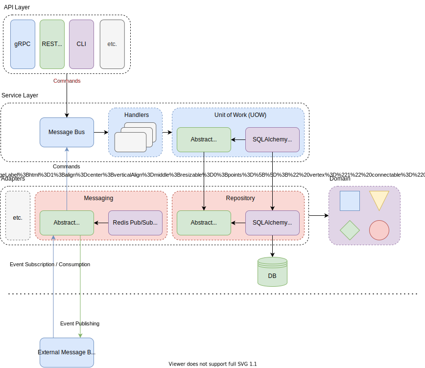
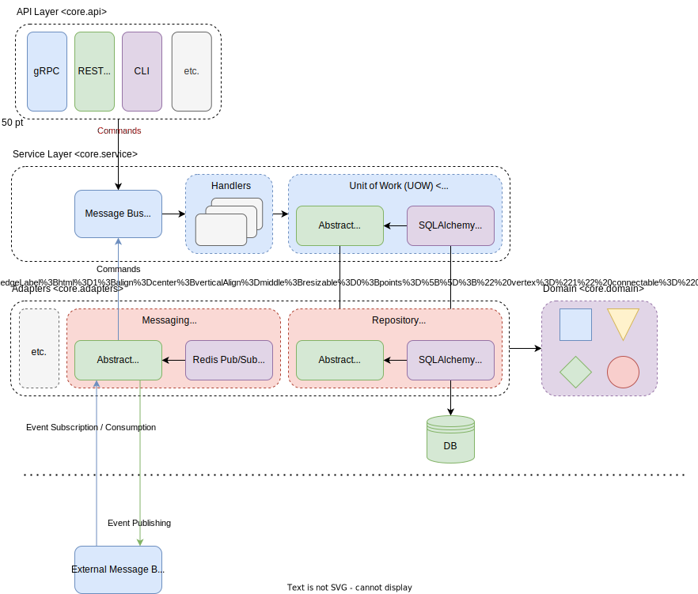

# Architecture

## Architecture Components

### Domain
The domain contains **models**, **events**, and **commands**.

**Domain modeling** is the process of abstracting reality
into models (entities), events, and commands that are triggered by those events. It is assumed that the domain can model
any real-world entity, thus being **complete**.

In an **event-driven system**, events define the information that can be received (*input messages*) and triggered
(*output messages*) by the system.

As in reality, events trigger **actions** or so-called *commands*. An event can trigger *one or a finite number* of
commands.

The triggered commands in turn define the **state changes** to the domain model of the system. Thus, a command execution
is required to change any model state.

### Message Bus
The **message bus** processes the incoming internal and external events and commands by routing them to relating
handlers. **Handler mappings** define the relationship between the **domain entity** (command or event) and the
implemented **handler (function)**.

The arguments (dependencies, e.g. UOW, adapters, etc.) of a *handler function* are injected using **signature
reflection**.

### Unit of Work (UOW)
A **unit of work (UOW)** is a stateful abstraction around data integrity. Each unit of work defines an atomic update to
the domain model.

The different states (e.g. commit, rollback) enforce data integrity and avoid inconsistency, especially in case of
errors.

### Adapters
**Adapters** define interfaces to communicate with external resources (e.g. third-party service,
databases, message broker, (email) notifications/messaging, file system, etc.).

#### Repository
A **repository** is an abstraction around persistent storage (e.g. database system). Each aggregate has its own
repository.

#### Message Broker
A **message broker** is an intermediary *message-oriented middleware* that enables asynchronous communication between 
clients. The clients can be **producers/publishers** or **consumers/subscribers** of messages.

The broker is responsible to receive, validate, process (ordering, filtering, queueing), and deliver the messages
(events).

As the broker acts as a decoupled, isolated middleware, producers and consumers do not necessarily need to know about
each other's existence. A broker summons a **star network topology**, reducing the overall **network complexity**,
supporting **scalability**, and **performance**. In the meantime, a broker introduces a highly system-critical component
that needs to ensure high resilience in the dimensions of **security**, **performance**, **scalability**, etc.

### API
The **API (application programming interface)** defines **external entrypoints** to the system.

In other architecture designs it is not uncommon that the API layer directly communicates with the handlers or even the
domain and corresponding adapters (like the repository). This design creates a strong coupling between the API layer and
the service/data layer.

Following the event-driven approach, event messages define the input/output information to and from the system.

Therefore, the API layer should only trigger the processing of events. The architecture overview diagram illustrates
that the triggered events of the API layer are consumed by the *message bus* that route the messages to their
corresponding handlers.

## Architecture Diagrams

### Overview
The following graphic provides a simplified overview about the system, divided into application layers:

| Application Layer | Description                                                                                                                                                                                                                                                                                                                                                                                                                                                                                                                                                                                                                                                                           |
|-------------------|---------------------------------------------------------------------------------------------------------------------------------------------------------------------------------------------------------------------------------------------------------------------------------------------------------------------------------------------------------------------------------------------------------------------------------------------------------------------------------------------------------------------------------------------------------------------------------------------------------------------------------------------------------------------------------------|
| API Layer         | APIs act as external entrypoints to the system. As the architecture follows an event-driven approach, event messages define the actions that can be triggered by the API layer.  The triggered event messages are processed by the service layer (in particular the message bus), thus enabling a loose coupling between individual API wrappers and the system.  This approach enables to easily add, remove, or swap out API endpoints, as the only dependency that needs to be maintained is the connection to the service layer's message bus.                                                                                                                                    |
| Service Layer     | The service layer is responsible to process triggered events and commands.  Events define the triggered actions of the API layer, while commands define the depending state changes of an event.  The events and commands are processed by the service layer's message bus, which monitors the execution of event/command messages and enforces data integrity by rolling back erroneous state changes.  The data integrity is enforced by the service layer's unit of work (UOW), which defines an abstraction around an atomic update to the system's data layer (e.g. repository adapter). The UOW can commit an atomic update in case of success, or rollback in case of failure. |
| Adapters Layer    | The adapters layer contains interfaces ("adapters") to communicate with external resources outside the system (e.g. repository / database, message broker, (email) notifications, etc.).                                                                                                                                                                                                                                                                                                                                                                                                                                                                                              |

### (Package) Organization
The following graphic illustrates the package organization of the framework.

(*Please note that all shown packages start with the prefix `atomos.<package>`, so the package `core.domain` would be
located at `atomos.core.domain`.*)

## References
- [Architecture Patterns with Python (H. J.W. Percival & B. Gregory) [web]](https://www.cosmicpython.com/book/preface.html)