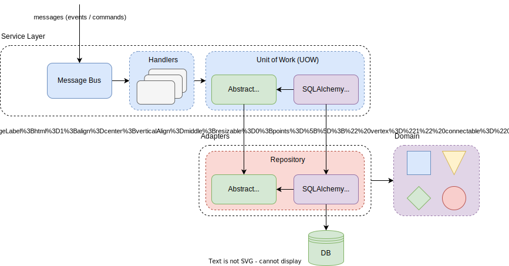
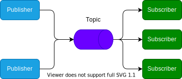
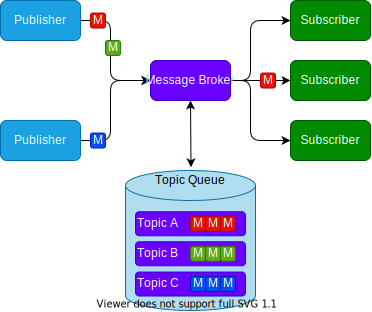
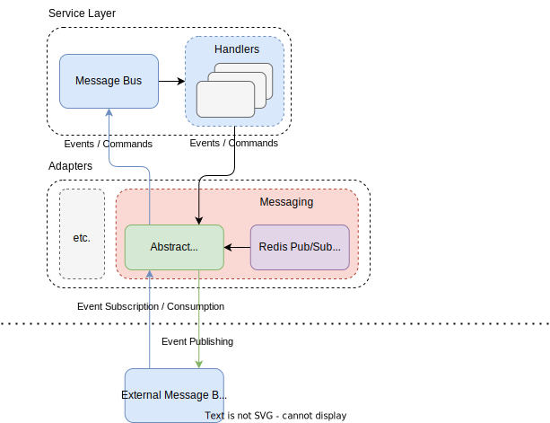

---
tags:
  - Framework
  - Architecture
---

# Framework

## Objective
> In computer programming, a software framework is an abstraction in which software, providing generic functionality,
> can be selectively changed by additional user-written code, thus providing application-specific software. It provides
> a standard way to build and deploy applications and is a universal, reusable software environment that provides
> particular functionality as part of a larger software platform to facilitate the development of software applications,
> products and solutions. Software frameworks may include support programs, compilers, code libraries, toolsets, and
> application programming interfaces (APIs) that bring together all the different components to enable development of a
> project or system. [^1]

The objective of this event-driven framework is to provide a system of high-level abstraction components
that act as building blocks to develop performant, secure, resilient, distributed, and scalable microservices.

## Building Blocks
Besides the [system architecture](../architecture/architecture.md), the framework provides a variety of system
components that act as the building blocks to create microservices.

## Domain
> A sphere of knowledge, influence, or activity. The subject area to which the user applies a program is the domain of
> the software. (Eric Evans) [^3]

The domain contains **models**, **events**, and **commands** that in conjunction abstract the reality or fictional
entities. **Domain engineering / modeling** refers to the process of abstracting real-world entities to digital
domain entities.

The framework provides abstract bases for custom models, events, and commands:

```python linenums="1" title="atomos/core/domain/events/event.py"
@dataclass
class Event:
    pass
```

```python linenums="1"
@dataclass
class UserCreated(event.Event):
    username: Optional[str]
    email: Optional[str]
    roles: Optional[List[role.Role]] = field(default_factory=lambda: [])
```

```python linenums="1" title="atomos/core/domain/commands/command.py"
@dataclass
class Command:
    pass
```

```python linenums="1"
@dataclass
class CreateUser(command.Command):
    username: str
    password: str
    email: str
    roles: Optional[List[role.Role]] = field(default_factory=lambda: [])
```

```python linenums="1" title="atomos/core/domain/model/model.py"
class EventQueue(abc.ABC):
    events: Optional[List[event.Event]] = []


class Model(EventQueue):
    id: Optional[str] = str(uuid4())
```
The `Model` base inherits the abstract base class `EventQueue`, which optionally stores a list of events. This allows
the service layer's message bus (`atomos/core/service/bus/message_bus.py`) to dynamically monitor newly triggered events
that relate to the model.

```python linenums="1"
@dataclass
class User(model.Model):
    username: str
    password: Optional[str] = None
    email: Optional[str] = None
    roles: Optional[List[role.Role]] = field(default_factory=lambda: [])
    id: Optional[uuid.UUID] = uuid.uuid4()

    def __hash__(self):
        return hash(self.username)

    def __eq__(self, other):
        return isinstance(other, User) and self.id is other.id
```

### Adapters

#### Repository
> Repositories are classes or components that encapsulate the logic required to access data sources. They centralize
> common data access functionality, providing better maintainability and decoupling the infrastructure or technology
> used to access databases from the domain model layer. (Microsoft) [^2]

Every repository defines a domain aggregate. The events and commands that are received by the service layer's message
bus will be handled by a unit of work (UOW), which defines an atomic update to the data persistence layer, in particular
the repository.

Thus, an abstract UOW depends on an abstract repository. Concrete UOW implementations (like a SQLAlchemy UOW) depend on
concrete repository implementations (like a SQLAlchemy repository implementation):

<figure markdown>
  
  <figcaption>Coomunication between the UOW (service layer) and repository (adapters layer)</figcaption>
</figure>

The framework provides an abstract base repository class that acts as an initial building block to develop custom
repository aggregates:

```python linenums="1" title="atomos/core/adapters/repository/repository.py"
class Repository(abc.ABC):
    collected_entities: Set[model.Model]

    def __init__(self):
        self.collected_entities = set()
```

A custom repository aggregate could then be defined as an abstract repository itself, depending on the abstract base
repository:

```python linenums="1"
class UserRepository(repository.Repository):
    def __init__(self):
        super().__init__()

    async def create_user(
        self,
        username: str,
        password: str,
        email: Optional[str],
    ):
        await self._create_user(username, password, email)
        self.collected_entities.add(user_model.User(username, password, email))

    async def get_user(self, username: Optional[str] = None, email: Optional[str] = None) -> Optional[user_model.User]:
        result = await self._get_user(username=username, email=email)
        if result:
            self.collected_entities.add(result)
        return result

    async def query_users(self, **criterion) -> Iterable[user_model.User]:
        results = await self._query_users(**criterion)
        if results:
            self.collected_entities.union(results)
        return results

    async def update_user(self, username: Optional[str], email: Optional[str], **update):
        await self._update_user(username, email, **update)

    async def delete_user(self, username: Optional[str] = None, email: Optional[str] = None):
        await self._delete_user(username=username, email=email)

    @abc.abstractmethod
    async def _create_user(
        self,
        username: str,
        password: str,
        email: Optional[str],
    ):
        raise NotImplementedError

    @abc.abstractmethod
    async def _get_user(self, username: Optional[str], email: Optional[str]) -> Optional[user_model.User]:
        raise NotImplementedError

    @abc.abstractmethod
    async def _query_users(self, **criterion) -> Iterable[user_model.User]:
        raise NotImplementedError

    @abc.abstractmethod
    async def _update_user(self, username: Optional[str], email: Optional[str], **update):
        raise NotImplementedError

    @abc.abstractmethod
    async def _delete_user(self, **criterion):
        raise NotImplementedError
```

The framework provides an abstract base SQLAlchemy repository that inherits the abstract base repository:

```python linenums="1" title="atomos/core/adapters/repository/sqlalchemy_repository.py"
class SQLAlchemyRepository(repository.Repository, abc.ABC):
    def __init__(self, session: Session = factory.DEFAULT_SESSION_FACTORY()):
        super().__init__()
        self.session: Session = session
```

The SQLAlchemy repository base can then be applied to create custom SQLAlchemy repository implementations:

```python linenums="1"
class SQLAlchemyUserRepository(
    sqlalchemy_repository.SQLAlchemyRepository,
    repository.IdentityRepository
):
    def __init__(self, session: Session = factory.DEFAULT_SESSION_FACTORY()):
        super().__init__(session)
        self.session = session

    async def _create_user(
        self,
        username: str,
        password: str,
        email: Optional[str],
    ):
        if not await self._get_user(username=username, email=email):
            self.session.add(user_model.User(username, password, email))

    async def _get_user(self, **criterion) -> Optional[user_model.User]:
        data = {
            k: v
            for k, v in criterion.items()
            if k in ['username', 'email']
            and v is not None
        }
        if not data:
            return None
        return self.session.query(user_model.User).filter_by(**data).first()

    async def _query_users(self, **criterion) -> Iterable[user_model.User]:
        return self.session.query(user_model.User).filter_by(**criterion).all()

    async def _update_user(self, username: Optional[str], email: Optional[str], **update):
        self.session.query(user_model.User).filter_by(username=username, email=email).update(**update)

    async def _delete_user(self, **criterion):
        result = await self._get_user(**criterion)
        if result:
            self.session.delete(result)
```

#### (Event) Messaging | Message Broker
**Event messaging** describes an architectural approach in which the communication between system components happens by
exchanging events. An event defines an immutable action that was triggered by a user/client or system component itself.

A **message broker** is an intermediary message-oriented middleware that is responsible to receive, process, and deliver
event messages. The messages are triggered by so-called producers/publisher, while the processed messages are delived to
corresponding consumers/subscribers. Producers and consumers do not necessarily need to know about each other's
existence. A message-oriented middleware (MOM), like a message broker, reduces the overall network complexity by
creating a star topology, thus enabling a loose coupling between the producers and consumers. In contrast, a message
broker introduces a highly system-critical component that needs to be designed and developed resilient in the dimensions
of security, performance, and scalability.

A message broker can additionally provide asynchronous communication between producers and consumers of messages by
implementing a **message queue**. Erroneous message processes can be temporarily stored on a **dead-letter queue** in
order to ensure delivery and data consistency.

<figure markdown>
  
  <figcaption>Middleware storage of messages and dedicated topics</figcaption>
</figure>

<figure markdown>
  
  <figcaption>Architectural design of a message broker (including topic queueing)</figcaption>
</figure>

The framework provides an abstract message broker, as well as a concrete Redis **publish/subscribe-broker (pub/sub)**
implementation.

<figure markdown>
  
  <figcaption>Communication between the service layer (handlers, message bus) and the adapters layer (message broker)</figcaption>
</figure>

```python linenums="1" title="atomos/core/adapters/messaging/message_broker.py"
class MessageBroker(abc.ABC):
    @abc.abstractmethod
    async def publish(self, channel: str, event: event.Event):
        logger.info('publishing: channel=%s, events=%s', channel, event)
        raise NotImplementedError

    @abc.abstractmethod
    async def subscribe(self, channel: str):
        logger.info('subscribing: channel=%s', channel)
        raise NotImplementedError

    @abc.abstractmethod
    async def process(self, handle: Callable[..., Awaitable]):
        raise NotImplementedError
```

```python linenums="1" title="atomos/core/adapters/messaging/redis_pub_sub_broker.py"
class RedisPubSubBroker(message_broker.MessageBroker):
    def __init__(self, host: str = config.REDIS_HOST, port: int = config.REDIS_PORT):
        self._client = redis.Redis(host=host, port=port)
        self._pub_sub = self._client.pubsub(ignore_subscribe_messages=True)

    async def publish(self, channel: str, event: event.Event):
        self._client.publish(channel, json.dumps(asdict(event)))

    async def subscribe(self, channel: str):
        self._pub_sub.subscribe(channel)

    async def process(self, handle: Callable[..., Awaitable]):
        for message in self._pub_sub.listen():
            await handle(message)
```

### Service Layer

#### Unit of Work (UOW)
A unit of work (UOW) defines an abstraction around an atomic update to the data layer (in particular the a repository
adapter in this architecture). The UOW enforces data integrity and consistency by monitoring the execution of state
changes, comitting the updates in case of success, or rolling back in case of failure.

The framework provides generic abstractions for the UOW that act as the building blocks to create custom UOW
implementations:

```python linenums="1" title="atomos/core/service/uow/unit_of_work.py"
T = TypeVar('T', bound=repository.Repository)

class UnitOfWork(Generic[T], contextlib.AbstractAsyncContextManager, abc.ABC):
    repository: T

    async def __aenter__(self) -> UnitOfWork:
        return self

    async def __aexit__(self, *args):
        await self.rollback()

    async def commit(self):
        await self._commit()

    async def rollback(self):
        await self._rollback()

    def collect_new_events(self):
        for entity in self.repository.collected_entities:
            while entity.events:
                yield entity.events.pop(0)

    @abc.abstractmethod
    async def _commit(self):
        raise NotImplementedError

    @abc.abstractmethod
    async def _rollback(self):
        raise NotImplementedError
```

```python linenums="1" title="atomos/core/service/uow/sqlalchemy_unit_of_work.py"
SessionFactory = Callable[..., Session]

T = TypeVar('T', bound=sqlalchemy_repository.SQLAlchemyRepository)


class SQLAlchemyUnitOfWork(Generic[T], unit_of_work.UnitOfWork[T], abc.ABC):
    def __init__(
        self,
        repository_factory: Type[sqlalchemy_repository.SQLAlchemyRepository],
        session_factory: SessionFactory = factory.DEFAULT_SESSION_FACTORY,
    ):
        self.repository_factory: Type[sqlalchemy_repository.SQLAlchemyRepository] = repository_factory
        self.session_factory: SessionFactory = session_factory

    async def __aenter__(self):
        self.session: Session = self.session_factory()
        self.repository: T = self.repository_factory(self.session)
        return await super().__aenter__()

    async def __aexit__(self, *args):
        await super().__aexit__(*args)
        self.session.close()

    async def _commit(self):
        self.session.commit()

    async def _rollback(self):
        self.session.rollback()
```

The generic design of the UOW bases allows to easily create custom UOW implementations: 

```python linenums="1" hl_lines="2 5"
class SQLAlchemyUserUnitOfWork(
    sqlalchemy_unit_of_work.SQLAlchemyUnitOfWork[sqlalchemy_repository.SQLAlchemyUserRepository], # (1)
):
    def __init__(self, session_factory: sqlalchemy_unit_of_work.SessionFactory = factory.DEFAULT_SESSION_FACTORY):
        super().__init__(sqlalchemy_repository.SQLAlchemyUserRepository, session_factory)
```

1. The `SQLAlchemyUserUnitOfWork` inherits the generic SQLAlchemy UOW base by providing the generic 
   `SQLAlchemyUserRepository` type that implements the `Repository` interface.


## References
[^1]: [Software framework (Wikipedia)](https://en.wikipedia.org/wiki/Software_framework)
[^2]: [Design the infrastructure persistence layer (Microsoft)](https://docs.microsoft.com/en-us/dotnet/architecture/microservices/microservice-ddd-cqrs-patterns/infrastructure-persistence-layer-design)
[^3]: [Domain (software engineering) (Wikipedia)](https://en.wikipedia.org/wiki/Domain_(software_engineering))