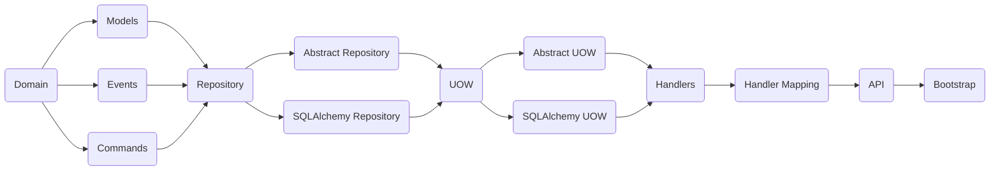

# Quickstart

```mermaid
graph LR
  A(Domain) --> B(Models);
  A --> C(Events);
  A --> D(Commands);
  B --> E(Repository);
  C --> E;
  D --> E;
  E --> F(Abstract Repository);
  E --> G(SQLAlchemy Repository);
  F --> H(UOW);
  G --> H;
  H --> I(Abstract UOW);
  H --> J(SQLAlchemy UOW);
  I --> K(Handlers);
  J --> K;
  K --> L(Handler Mapping);
  L --> M(API);
  M --> N(Bootstrap);
```